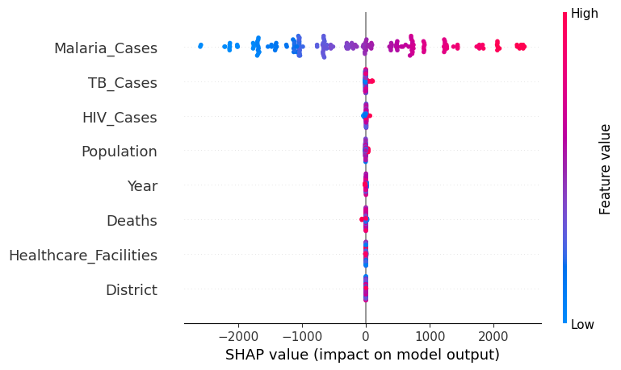
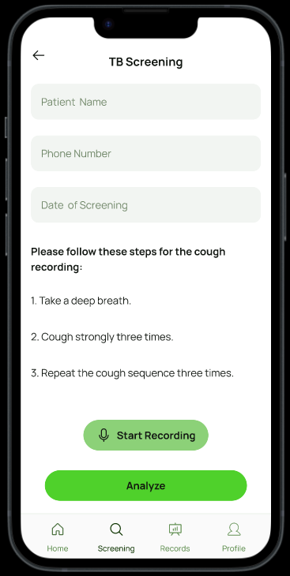
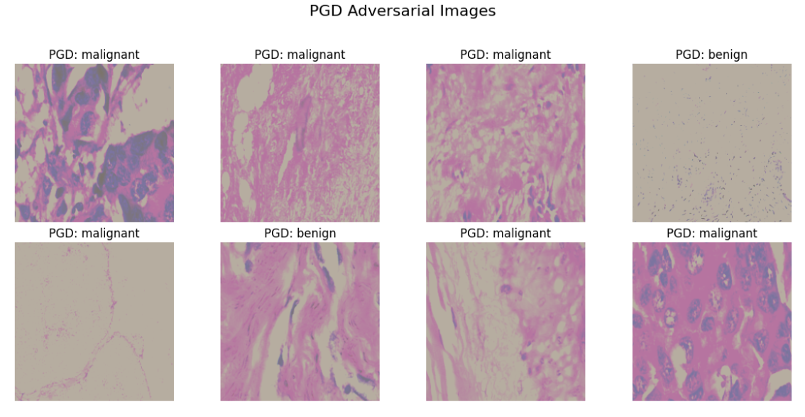
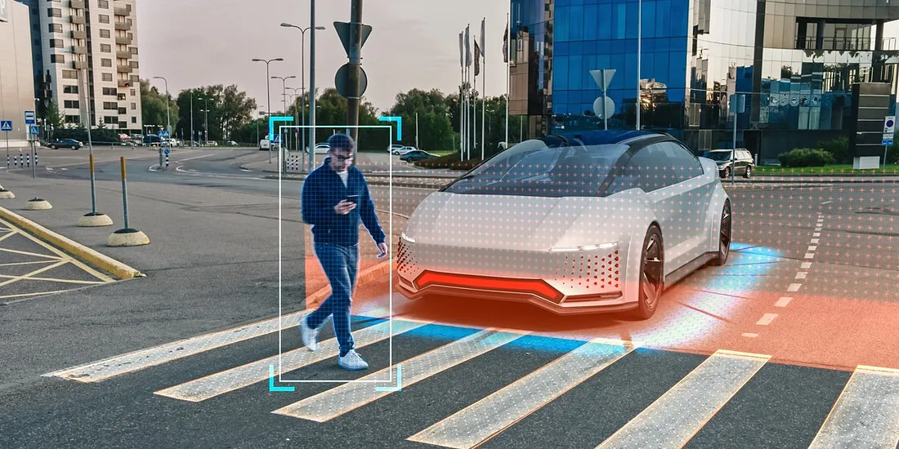

#  Brandone Fonya 

---

I am a final year Masters student in Engineering Artificial Intelligence under the [College of Engineering](https://engineering.cmu.edu/) at Carnegie Mellon University, where I focus on machine learning and computer vision. I am advised by [Prasenjit Mitra](https://www.africa.engineering.cmu.edu/news/2025/02/25-mitra-announcement.html). My research focus is on Deep Learning for computer vision and its applications in medical imaging and Healthcare.

Prior to joining CMU, I completed my Bachelors (Hons) in Software Engineering, May 2024 from The ICT University In Cameroon. 

Apart from work, I enjoy travelling, reading and watching documentaries.

\[[CV](/static/brandone-cv-march2025.pdf)\]  \[[ORCID](https://orcid.org/0009-0004-5793-9323)\]

---

## Contact

**Email:** bfonya at andrew.cmu.edu

\[[Twitter](https://twitter.com/princebrandone)\] \[[LinkedIn](https://www.linkedin.com/in/brandone-fonya-217654240/)\] \[[Github](https://github.com/fonyabrandone)\]  

---

## Research

<table>
  <tr>
    <td></td>
    <td style="padding-left: 20px;">
      <b><a href="https://drive.google.com/file/d/1S-NYIZbBHkzcAabAO3HTMByy7EejmolS/view" target="_blank">
      Evaluating Health Facility Distribution and District-Level Disease Prevalence in Rwanda: A Data-driven Approach</a></b> 
      <i>Brandone Fonya</i>, Irene Busah, Michaella Rugumbira, Nchofon Tagha, Emily Aiken 
      <i>Accepted at <a href="https://ephconference.eu/" target="_blank">European Public Health Conference (EPH)</a>, 2025</i>
      
This paper analyzes the geographic distribution of health facilities across Rwanda in relation to the prevalence of major diseases such as malaria, tuberculosis, and HIV at the district level. Using geospatial mapping, national health survey data, and machine learning models, it identifies mismatches between disease burden and healthcare access. The goal is to propose data-driven strategies for more equitable and efficient allocation of health resources in developing countries.

    </td>
  </tr>

  <tr><td colspan="2" style="padding: 10px;"></td></tr>

  <tr>
    <td></td>
    <td style="padding-left: 20px;">
      <b>Low-cost Tuberculosis screening with deep learning using solicitated cough sounds</b> 
      Carnegie Mellon-Africa – MakCHS joint research partnership 
      <i>Work in progress</i>
      
We are exploring the use of deep learning models to enable low-cost, non-invasive tuberculosis (TB) screening by analyzing solicited cough sounds. By training classifiers on acoustic features extracted from labeled cough audio, it aims to distinguish TB-positive cases from healthy individuals. The approach is designed to support early detection in low-resource settings where traditional diagnostics are limited.

    </td>
  </tr>

  <tr><td colspan="2" style="padding: 10px;"></td></tr>

  <tr>
    <td></td>
    <td style="padding-left: 20px;">
      <b>Multi-defense framework against adversarial attacks on deep learning medical imaging models</b> 
      <i>Brandone Fonya</i>, Prasenjit Mitra 
      <i>Work in progress</i> 
      
Here we're proposing a multi-defense framework for deep learning medical imaging models (ResNet18 and VGG16) against PGD and DeepFool adversarial attacks. It combines adversarial training, input preprocessing, and model ensembling to improve model robustness.  Evaluated on the Breast Cancer histopathology dataset, our approach aims at offering a more resilient defense against a broader range of attack vectors, addressing both security and clinical applicability. 

    </td>
  </tr>

  <tr><td colspan="2" style="padding: 10px;"></td></tr>

  <tr>
    <td></td>
    <td style="padding-left: 20px;">
      <b><a href="https://drive.google.com/file/d/1wT99_8svqf21GBSp--bEycTQ9OksaFJ3/view" target="_blank">
      Uncertainty-aware Autonomous Driving for Unstructured Urban Environments: Modelling Pedestrian Behaviors in African Metropolitan Cities</a></b> 
      Victor Miene, <i>Brandone Fonya</i>, Joshua Momo, Ozan Tonguz 
      <i>Preprint</i>
       
This course-related research focuses on developing an uncertainty-aware autonomous driving system tailored for highly unstructured urban environments in African metropolitan cities. Using deep learning models like ConvLSTM, it models and predicts pedestrian behaviors under high variability and limited infrastructure conditions. The goal is to enhance safety and decision-making for autonomous vehicles and systems navigating complex, unpredictable urban scenarios. 

    </td>
  </tr>
</table>

---

## Projects
- Real-Time Sign Language Recognition and Speech Transcription using Deep Learning  
  *Spervised by [Clarence Worrell](https://insights.sei.cmu.edu/authors/clarence-worrell/): This project employs a Convolutional Neural Network (CNN) trained on the Sign Language MNIST dataset to classify American Sign Language (ASL) hand signs from live video input via Mediapipe. The classified gestures are then converted into spoken words using a text-to-speech engine, enabling real-time audio feedback.*  
  *Januray 2025 - May 2025* [[Code]](https://github.com/FonyaBrandone/Sign-language-project-deep-learning)

- ClimateSmart: Smart Agriculture for a greater harvest  
  *This project uses real time location and environmental data to provide best farm practices, recommended fertilizers and seasons for a better harvest to farmers based on their farm location and crop types*  
  *December 2023 - May 2024* [[Website]](https://climatesmart.000webhostapp.com/)

- Eschools LMS  
  *This project tackles the challenges faced by crisis affected Cameroonian high school students to attend physical classes, by creating a typical online learning environment for students. From AI study bot and live classes to Attendance tracking, class recordings, note Sharing, assignment and Examination coordination by both students and teachers, under the supervision of their school administration.*  
  *December 2022 - July 2024* [[Website]](https://eschools.netlify.app/)

---

##  Work Experience

<!--  -->
- Graduate Research Intern - AI for Healthcare @Carnegie Mellon University, under the supervision of [Conrad Tucker](https://engineering.cmu.edu/directory/bios/tucker-conrad.html) and [Edwin Mugume](https://scholars.cmu.edu/6761-edwin-mugume/publications)  
 *Full time*  
 *May 2025 - Present*

- Graduate IT Associate - Full Stack developer @Carnegie Mellon University  
 *Part time*  
 *August 2024 - May 2025*

<!--  -->

 ---

## Education
<!--  -->

<table>
  <tr>
    <td>
      
    </td>
    <td style="padding-left: 20px; vertical-align: middle;">
      <b>Carnegie Mellon University</b> 
      August 2024 – May 2026 (Expected) 
      Master of Science in Engineering Artificial Intelligence (<b>MSEAI</b>) 
    </td>
  </tr>

    <tr>
    <td>
      
    </td>
    <td style="padding-left: 20px; vertical-align: middle;">
      <b>The ICT University</b> 
      September 2020 – May 2024  
      Bachelor of Science (Hons) in Software Engineering  
      GPA: 3.65 / 4.0, ranked 1st in department
    </td>
  </tr>
</table>

<!--  -->

 ---

##  Teaching & Service 
<!--  -->
- Graduate Teaching Assistant for [(18-661) Introduction to Machine Learning for Engineers](https://courses.ece.cmu.edu/18661) under [Carlee Joe-Wong](https://www.ece.cmu.edu/directory/bios/joe-wong-carlee.html), *Fall 2025*

- Graduate Teaching Assistant for [(04-701) Research Methods in Engineering](https://www.africa.engineering.cmu.edu/academics/courses/04-701.html), under [Ismaila Dabo](https://mse.engineering.cmu.edu/directory/bios/dabo-ismaila.html), *Fall 2025*  

- IEEE Student Member, *2024 - present*
<!--  -->

---

